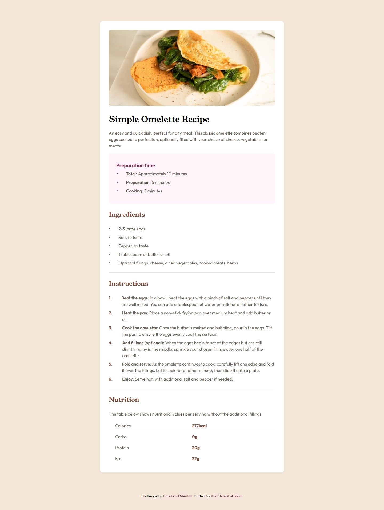
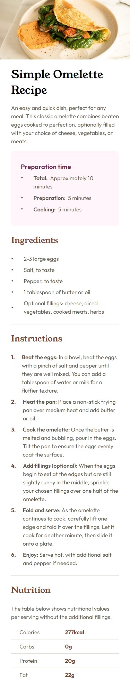

# Frontend Mentor - Recipe page solution

This is a solution to the [Recipe page challenge on Frontend Mentor](https://www.frontendmentor.io/challenges/recipe-page-KiTsR8QQKm). Frontend Mentor challenges help you improve your coding skills by building realistic projects.

## Table of contents

- [Overview](#overview)
  - [The challenge](#the-challenge)
  - [Screenshot](#screenshot)
  - [Links](#links)
- [My process](#my-process)
  - [Built with](#built-with)
  - [What I learned](#what-i-learned)
  - [Useful resources](#useful-resources)
- [Author](#author)

## Overview

❗ This project is a little bit challenging for a newbie 😅. But after spending lots of time, I made it 😉.

- Project Start Date: 11 February 2024
- Project Duration: 2 hours 38 minutes

### Screenshot

|             Desktop Version             |             Mobile Version             |
| :-------------------------------------: | :------------------------------------: |
|  |  |

### Links

- [Solution URL here](https://github.com/akmtasdikulislam/Recipe-page)
- [Live site URL here](https://akmtasdikulislam.github.io/Recipe-page/)

## My process

- At first, I linked the `style.css` & `Google Fonts CDN` with the `index.html`

- Secondly, I set the `CSS color variables` and base _font-size_ for this project into the `:root` of the _CSS Document_ which were given in the `style-guide.md`.

- Thirdly, I initialzed the _CSS Document_.

- Then, I wrote necessary code to structure the given UI Design Sample thorugh `HTML`
- Then, I wrote necessary css codes to match as close as possible with the _UI Design Sample_

### Built with

- Semantic HTML5 markup
- CSS custom properties
- Flexbox

### What I learned

By doing this project, I learned the following solutions,

- How to modify list item marker?

```css
/* --- UNORDERED LIST --- */
/* By using ::before pseudo element */
ul li::before {
  content: "\2022"; /* Inserting a circle bullet (•) using css code */
  font-size: 1.25em; /* Increasing its font-size */
  margin-right: 1.5em; /* Adding some intend to right */
}

/* --- ORDERED LIST --- */
ol {
  /* At first we are assinig a counter to parent element which will count all the list item in it */
  counter-reset: item;
  /* Removing default listing marker */
  list-style: none;
}

ol li {
  /* Then linking the parent counter with its child list items */
  counter-increment: item;
  /* Applying css flexbox to vertically align the marker and list text to center */
  display: flex;
  align-items: flex-start;
}

ol li::before {
  /* Here using ::before - css pseudo element to set new list marker. As it is a orderded list, it is assigning the current list item sequence position number. I'm also adding an extra dot (.) with it by putting within quotation mark */
  content: counter(item) ".";
  /* Styling the marker */
  color: var(--nutmeg);
  font-weight: 700;
  margin-right: 1.25em;
  text-align: center;
}
```

- How to align next line with the previous line of a paragraph after a line break

```css
ol li p {
  /* Here adding a padding left so that it have some space to left on every new line */
  padding-left: 1em;
  /* Then aligning the paragraph to left */
  text-align: left;
  /* Removing text indent so that the new line don't have any extra space on its before accept the padding left we specified earlier */
  text-indent: 0em;
}
```

### Useful resources

- [How to Control the Space Between Bullets and `<li>` Elements](https://www.w3docs.com/snippets/html/how-to-control-the-space-between-bullets-and-li-elements.html) - This helped me to increase gap between the bullet marker and list texts.

- [Custom bullet symbol for `<li>` elements in `<ul>` that is a regular character](https://stackoverflow.com/questions/7698764/custom-bullet-symbol-for-li-elements-in-ul-that-is-a-regular-character-and) - This helped me to modify the list marker.

- [Custom bullets with CSS `::marker`](https://web.dev/articles/css-marker-pseudo-element) - This is an advanced way to customize the list marker using css `::marker` pseudo element.

- [Can you style ordered list numbers?](https://stackoverflow.com/questions/23610151/can-you-style-ordered-list-numbers) - This helped me to customize ordered list items marker or numbers.
- [How to create the bullet symbol in HTML](https://www.educative.io/answers/how-to-create-the-bullet-symbol-in-html) - This helped me by letting me know how to use `HTML Entites`.

- [BULLET - Toptal HTML Entites](https://www.toptal.com/designers/htmlarrows/punctuation/bullet/)- This helped me to get the filled circle bullet (•) css code to use as css `::before` pseudo element's content.

- [How to set indent the second line of paragraph using CSS ?](https://www.geeksforgeeks.org/how-to-set-indent-the-second-line-of-paragraph-using-css/)- This helped me to align the next line of a paragraph with the previous line after a line break.

## Author

- Frontend Mentor - [@akmtasdikulislam](https://www.frontendmentor.io/profile/akmtasdikulislam)
- Twitter - [@Akm_Tasdikul](https://twitter.com/Akm_Tasdikul)
